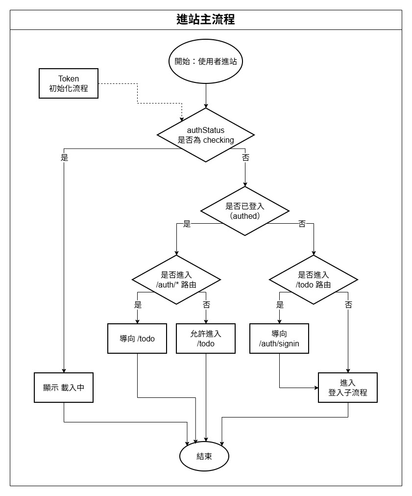
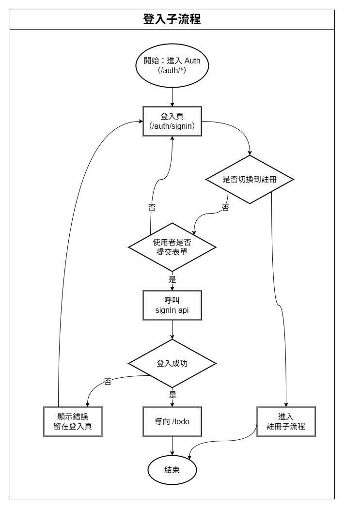
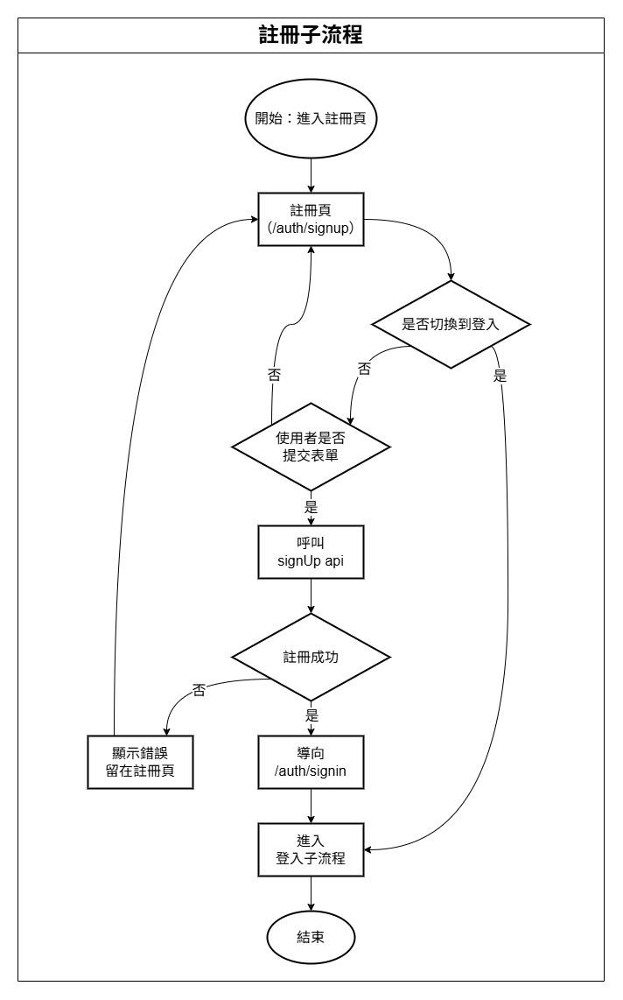
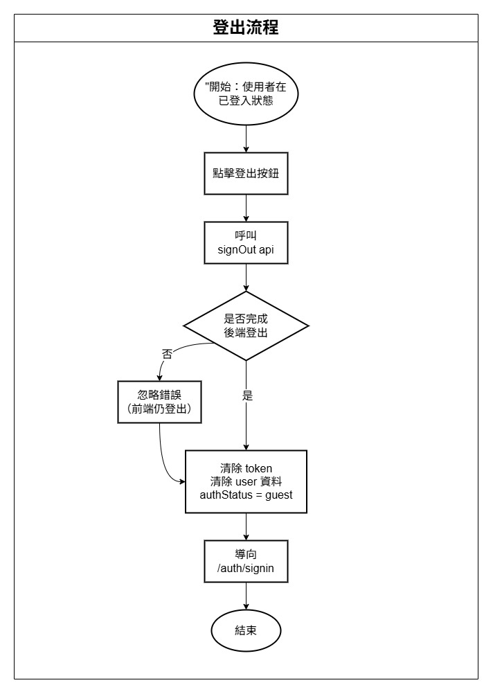
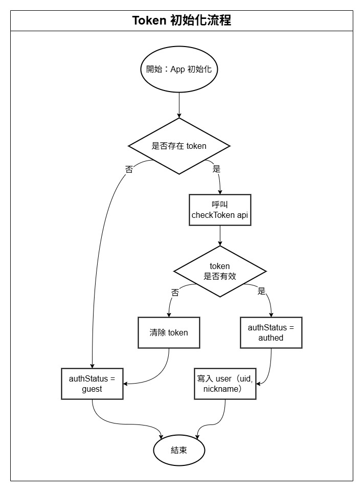
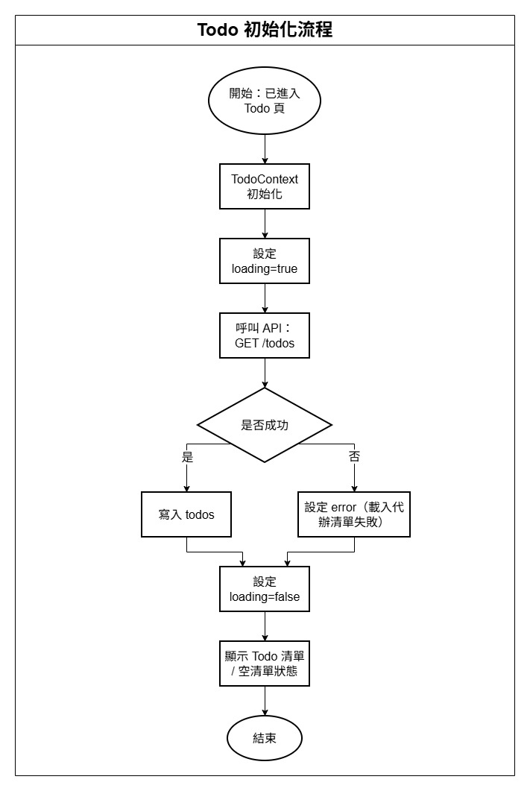
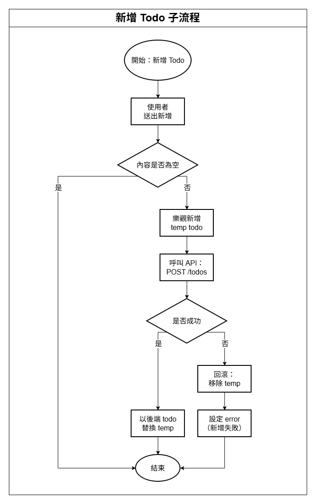
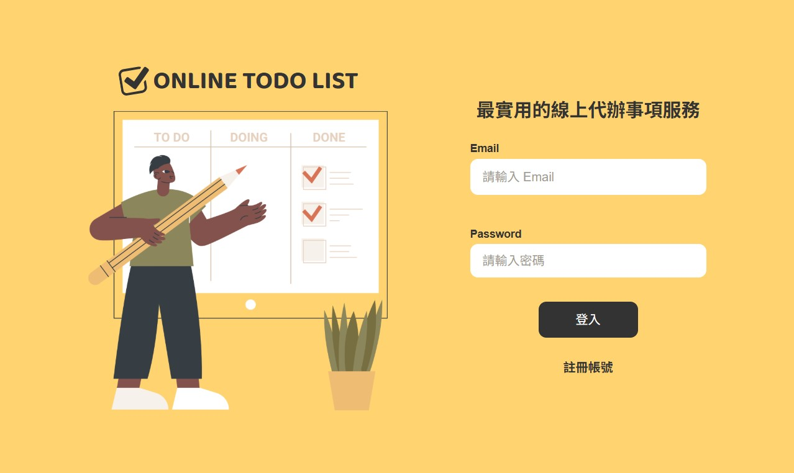
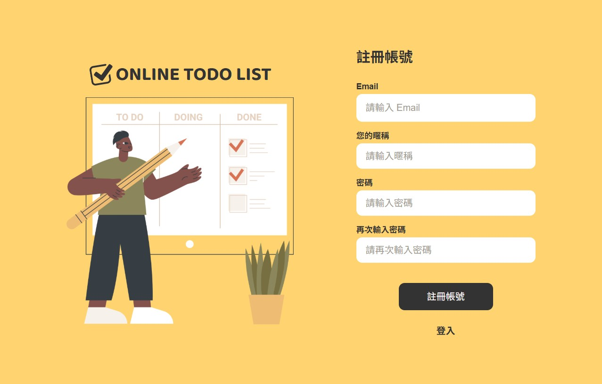
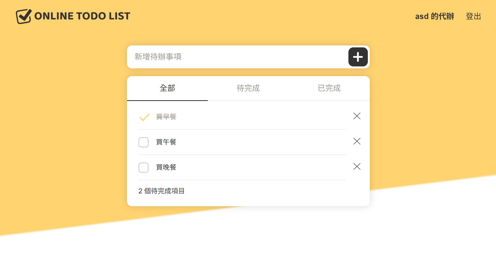

<h1 align="center">📝 Online Todo List</h1>

<p align="center">
  一個以 React 打造的線上代辦事項應用，聚焦於清楚的狀態管理、穩定的非同步流程，以及良好的使用體驗。
</p>

<p align="center">
  <a href="https://react.dev/">
    
  </a>
  <a href="https://vitejs.dev/">
    
  </a>
  <a href="https://reactrouter.com/">
    
  </a>
  <a href="https://sass-lang.com/">
    
  </a>
</p>

---

## 📌 專案介紹

本專案為前端練習專案，實作一個具備登入機制的線上代辦事項（Todo）系統。
專案重點不僅在 CRUD 功能本身，而是放在 **狀態管理架構、非同步請求處理、以及 View 職責切分**。

整體設計目標為：

- 狀態來源單一、可預期
- API 非同步流程清楚（loading / error / rollback）
- View 元件只負責呈現，不承擔商業邏輯
- 能清楚說明設計決策與流程

---

## 🔄 流程設計

### 🧭 進站主流程


- 使用者進站
- 檢查是否存在 token
- 驗證 token 是否有效
- 已登入導向 Todo 頁
- 未登入導向登入頁

---

### 🔐 登入流程


- 使用者輸入帳號密碼
- 呼叫登入 API
- 成功後儲存 token，設定登入狀態
- 失敗則顯示錯誤訊息

---

### 📝 註冊流程


- 使用者填寫註冊資料
- 呼叫註冊 API
- 成功後導向登入頁

---

### 🚪 登出流程


- 使用者主動登出或 token 驗證失敗時觸發
- 清除 token 與使用者資料，回到未登入狀態

---

### 🔑 Token 初始化流程


- App 啟動時檢查是否存在 token
- 呼叫 token 驗證 API
- 有效則設定為已登入狀態
- 無效則清除資料並進入未登入狀態

---

### 📋 Todo 初始化流程


- 進入 Todo 頁
- 呼叫取得 Todo 清單 API
- 成功後寫入狀態
- 失敗顯示錯誤
- token 無效時觸發登出流程

---

### ➕ 新增 Todo（Optimistic Update）


- 先行新增暫存 Todo
- 呼叫新增 API
- 成功：以正式資料取代
- 失敗：rollback 並顯示錯誤

---

### ✏️ 編輯 / 🗑 刪除 / ✅ 切換狀態（彙總說明）

以下三種操作在行為與狀態管理上採用相同的設計模式，因此合併說明：

- **編輯 Todo**
- **刪除 Todo**
- **切換完成狀態**

共通設計重點如下：

- 操作時立即更新畫面（Optimistic Update）
- 同步呼叫對應 API
- API 失敗時進行 rollback，恢復先前狀態
- 對使用者顯示錯誤提示，但不影響其他操作

此設計可確保操作即時性，同時維持資料一致性。

---

### 🔍 Todo 篩選流程（補充說明）

- 使用者切換篩選條件（全部 / 未完成 / 已完成）
- 依目前狀態即時計算顯示結果
- 不觸發 API 請求

---

## 📸 專案畫面

以下為實際操作畫面截圖，用於呈現使用者在不同階段的操作體驗。
流程與狀態行為細節已於前述流程圖章節說明，此處僅展示最終畫面。

---

### 🔐 登入頁



- 提供 Email / Password 登入
- 作為未登入狀態的預設入口
- 與註冊頁共用一致的版型與視覺風格

---

### 📝 註冊頁



- 建立新帳號（Email / 暱稱 / 密碼）
- 驗證完成後導向登入流程
- 表單結構與登入頁保持一致

---

### ✅ Todo 主畫面



- 新增代辦事項
- 切換篩選狀態（全部 / 待完成 / 已完成）
- 編輯、刪除與完成狀態切換
- 即時顯示剩餘待完成項目數量

> 📌 編輯 / 刪除 / 切換狀態的行為流程與錯誤處理，
> 已於「流程設計」章節以流程圖方式說明。

---

## ✨ 功能說明

- **登入 / 註冊**
  - 驗證使用者身分
  - token 驗證與自動登出處理

- **Todo 管理**
  - 新增 / 編輯 / 刪除 / 切換完成狀態
  - 全流程採 optimistic update
  - API 失敗時自動 rollback

- **篩選功能**
  - 顯示全部 / 未完成 / 已完成
  - 支援鍵盤操作（左右鍵、Home、End）

- **錯誤與載入狀態**
  - request state 拆分（fetch / create / mutate）
  - 錯誤訊息與 loading 顯示一致化

---

## 🧱 狀態管理架構

本專案使用 React `useReducer` 與 Context 進行狀態管理，並明確區分責任：

### AuthContext
- 管理登入狀態（checking / authed / guest）
- token 初始化與登出集中處理

### AuthPageContext
- 僅管理登入 / 註冊頁的 loading 與 error
- reducer 不處理 side effect

### TodoContext
- 管理 Todo 清單與 request 狀態
- reducer 模組化拆分
- action 命名統一為 `DOMAIN / OPERATION / DETAIL`

```js
{
  todos,
  filter,

  fetchLoading,
  createLoading,
  mutateLoading,

  fetchError,
  createError,
  mutateError
}

```

---

## 📁 專案結構

本專案採用「**Page × View × Context × Service**」的分層結構，
清楚區分路由、畫面呈現、狀態管理與 API 存取責任。

```text
src/
├─ assets/                   # 圖片、圖示、全域樣式
│
├─ components/
│  ├─ common/                # 共用純呈現元件
│  │   └─ LoadingState/       # 全站 loading 顯示
│  │
│  ├─ AuthView/              # Auth 頁 View
│  │   ├─ SignInForm/
│  │   └─ SignUpForm/
│  │
│  └─ TodoListView/          # Todo 主頁 View
│      ├─ TodoCreateForm/    # 新增 Todo
│      ├─ TodoFilterTabs/    # 篩選頁籤（含鍵盤操作）
│      ├─ TodoItem/          # 單一 Todo 顯示 / 編輯
│      ├─ ErrorBox/          # 錯誤顯示
│      ├─ EmptyState/        # 空清單狀態
│      └─ constants.js       # View 專用常數
│
├─ context/                  # 全域與頁面層級狀態管理
│  ├─ AuthContext.jsx        # 登入狀態、token 初始化與登出
│  ├─ AuthPageContext.jsx    # 登入 / 註冊頁 loading / error
│  │
│  └─ todo/
│      ├─ todoInitialState.js
│      ├─ todoTypes.js
│      ├─ todoReducer.js
│      └─ todoSelectors.js
│
├─ pages/                    # 路由對應頁面（負責組裝）
│  ├─ Auth/
│  │   └─ AuthPageContext.jsx
│  │
│  └─ TodoList/
│      └─ TodoPageContext.jsx
│
├─ routes/
│  └─ guards.jsx             # Public / Private Route 保護
│
├─ services/                 # API 呼叫與資料存取
│
├─ flows/                    # 流程圖（README 使用）
├─ screenshots/              # 專案畫面截圖
│
├─ App.jsx                   # 路由設定
└─ main.jsx                  # 專案進入點

```

---

## 🧩 View 與狀態的責任切分

- **Pages**
    - 負責路由對應與頁面組裝
    - 不包含商業邏輯
- **View Components**
    - 僅負責畫面與互動
    - 直接使用對應的 Page Context
    - 不接收大量 props
- **Context / Reducer**
    - 管理狀態與非同步流程
    - 對外提供 actions
    - reducer 不處理 side effect

---

## ⚙️ 非同步請求與狀態設計

Todo 相關操作依性質拆分為三類 request state：

- **fetch**
  - 用於初始化 Todo 清單
  - 控制整頁載入與初始化錯誤顯示

- **create**
  - 專責新增 Todo 行為
  - 避免新增時影響既有清單操作

- **mutate**
  - 用於編輯 / 刪除 / 切換完成狀態
  - 多個操作共用，確保行為一致

此設計可避免不同操作互相影響 loading 與 error 狀態，
並讓 UI 能針對不同操作顯示對應的回饋。

---

## 🔁 Optimistic Update 設計

Todo 的新增、編輯、刪除與狀態切換皆採用 optimistic update：

- 操作時立即更新 UI
- 同步發送 API 請求
- 成功則確認狀態
- 失敗時 rollback 並顯示錯誤

此模式可提升操作即時性，同時維持資料一致性。

---

## 🛠 使用技術

- React 19
- Vite
- React Router
- SCSS（CSS Module）
- Context + useReducer
- Axios

---

## 🚀 安裝與執行

```bash
# 安裝套件
npm install

# 啟動開發環境
npm run dev

```

---

## 📦 專案定位

本專案為 **架構導向的前端練習專案**，

著重於：

- 清楚的狀態管理設計
- 可預期的非同步流程
- View 與邏輯的責任切分
- 可被文件與流程圖清楚說明的設計決策